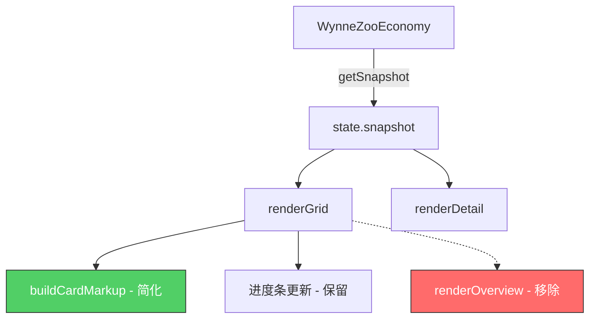

# 技术设计文档：动物图鉴卡册化改造

## 概述

本次改造将现有动物图鉴界面从"自然博物馆档案"风格转变为简洁的"卡册"风格。核心改动包括：移除概览区域（Overview Band）、简化卡片内容（仅保留立绘/名字/稀有度）、保持 3×3 网格布局、顶部仅保留收集进度条。改造基于现有代码进行增量修改，不涉及重写。

涉及的文件：
- `index.html` — 移除概览区域 HTML，简化卡片容器结构
- `js/zoo/zoo-collection.js` — 修改 `buildCardMarkup()`、移除 `renderOverview()` 调用、清理相关 refs
- `style.css` — 隐藏/移除概览区域样式，调整卡片样式使立绘占据更大面积

## 架构

本次改造不改变系统整体架构。`zoo-collection.js` 仍然是一个 IIFE 模块，通过 `window.WynneZooCollection` 暴露 API。数据流保持不变：`WynneZooEconomy.getSnapshot()` → `state.snapshot` → 渲染函数。

改造范围限定在视图层：



## 组件与接口

### 需要修改的函数

| 函数 | 文件 | 改动说明 |
|------|------|----------|
| `buildCardMarkup(species)` | zoo-collection.js | 移除编号标签（No.XX）和状态标签（已记录/待发现），仅保留立绘、名字、稀有度 |
| `renderGrid()` | zoo-collection.js | 移除对 `renderOverview()` 的调用 |
| `renderOverview(collection)` | zoo-collection.js | 整个函数可保留但不再被调用，或直接删除 |
| `cacheDom()` | zoo-collection.js | 移除概览区域相关的 DOM 引用（overviewName, overviewDescription 等） |

### 需要修改的 HTML 结构

| 元素 | 改动 |
|------|------|
| `.collection-overview-band` | 整个 `<section>` 移除 |
| `.collection-progress-card` | 保留，位置上移至标题栏下方 |
| `.collection-grid` | 保留，位置上移 |
| `.collection-card` 内部结构 | 简化：移除 `.collection-card-chip-row`，保留立绘、名字、稀有度 |

### 需要修改的 CSS

| 选择器 | 改动 |
|--------|------|
| `.collection-overview-band` 及子元素 | 添加 `display: none` 或移除 |
| `.collection-card-chip-row` | 添加 `display: none` 或移除 |
| `.collection-card-media` | 调整高度，使立绘占据卡片更大面积 |
| `.collection-card-content` | 简化内边距，仅容纳名字和稀有度 |

### 不变的接口

公开 API `WynneZooCollection` 的 `init()`, `show()`, `hide()`, `render()`, `getRefs()` 签名保持不变。`WynneZooEconomy` 提供的 snapshot 数据结构不变。详情弹窗（Detail Panel）的完整功能保持不变。

## 数据模型

数据模型无变更。`snapshot.collection` 结构保持不变：

```javascript
{
  species: [
    {
      id: string,
      name: string,
      rarity: string,        // '普通' | '少见' | '稀有' | '史诗' | '传说'
      imageSrc: string,       // 立绘图片路径
      imageAlt: string,
      summary: string,
      traits: string,
      habitat: string,
      unlocked: boolean,
      unlockedAt: number,     // 时间戳
      isPendingGuide: boolean,
      pageIndex: number
    }
  ],
  totalPages: number,
  totalSpecies: number,
  unlockedCount: number,
  pendingGuideSpeciesId: string,
  lastViewedSpeciesId: string
}
```

卡片渲染时仅使用 `imageSrc`、`name`、`rarity`、`unlocked` 字段，其余字段仅在详情弹窗中使用。


## 正确性属性（Correctness Properties）

*属性（Property）是指在系统所有合法执行路径中都应成立的特征或行为——本质上是对系统应做什么的形式化陈述。属性是人类可读规格说明与机器可验证正确性保证之间的桥梁。*

### Property 1: 卡片仅包含立绘、名字和稀有度

*For any* species 数据，`buildCardMarkup(species)` 生成的 HTML 中应仅包含三个可见内容元素：一个 `` 立绘图片、一个名字文本节点、一个稀有度文本节点。不应包含编号标签（No.XX）或状态标签（已记录/待发现）。

**Validates: Requirements 2.1, 2.2, 2.3**

### Property 2: 未解锁卡片显示占位文字

*For any* species 数据且 `unlocked === false`，`buildCardMarkup(species)` 生成的 HTML 中名字文本应为 `"???"` 且稀有度文本应为 `"未知"`。

**Validates: Requirements 2.4**

### Property 3: 卡片元素顺序——立绘在前，名字居中，稀有度在后

*For any* species 数据，`buildCardMarkup(species)` 生成的 HTML 中，立绘 `` 元素应出现在名字元素之前，名字元素应出现在稀有度元素之前。

**Validates: Requirements 2.6**

### Property 4: 每页渲染恰好 9 个卡片槽位

*For any* species 列表和任意合法页码，渲染该页时生成的卡片总数（真实卡片 + 空白占位卡片）应恰好等于 9，且真实卡片数量不超过 9。

**Validates: Requirements 3.2, 3.3**

### Property 5: 翻页边界正确

*For any* collection 数据，当 `currentPage` 为 0 时上一页按钮应禁用；当 `currentPage` 为最后一页时下一页按钮应禁用；`showPage()` 不应将页码设置为负数或超过最大页码。

**Validates: Requirements 3.4**

### Property 6: 进度文字格式正确

*For any* `unlockedCount` 和 `totalSpecies` 值，进度条文字应匹配格式 `"已收集 {unlockedCount} / {totalSpecies}"`。

**Validates: Requirements 4.2**

### Property 7: 进度填充比例正确

*For any* `unlockedCount`（≥0）和 `totalSpecies`（>0），进度条填充宽度百分比应等于 `(unlockedCount / totalSpecies) * 100`，且不超过 100%。当 `totalSpecies` 为 0 时，填充宽度应为 0%。

**Validates: Requirements 4.3**

### Property 8: 详情弹窗仅对已解锁卡片打开

*For any* species 数据，调用 `openDetail(speciesId)` 时：若该 species 的 `unlocked === true`，则详情弹窗应可见；若 `unlocked === false`，则详情弹窗应保持隐藏。

**Validates: Requirements 5.1, 5.2**

### Property 9: 详情弹窗包含完整信息

*For any* 已解锁的 species 数据，当详情弹窗打开时，应包含该 species 的立绘、名字、稀有度、图鉴简介（summary）、栖居环境（habitat）、习性特征（traits）和解锁日期（unlockedAt）。

**Validates: Requirements 5.3**

### Property 10: 关闭详情后恢复网格视图

*For any* 已打开详情弹窗的状态，调用 `closeDetail()` 后，详情弹窗应隐藏，`state.detailSpeciesId` 应为空字符串。

**Validates: Requirements 5.4**

### Property 11: 返回按钮文字反映当前视图状态

*For any* 视图状态，当 `state.detailSpeciesId` 非空时，返回按钮文字应包含"返回图鉴"；当 `state.detailSpeciesId` 为空时，返回按钮文字应包含"返回主页"。

**Validates: Requirements 6.3**

## 错误处理

本次改造的错误处理策略与现有代码保持一致：

| 场景 | 处理方式 |
|------|----------|
| `species` 数据缺失字段 | `buildCardMarkup` 使用默认值（名字默认空字符串，稀有度默认"普通"） |
| `imageSrc` 为空或加载失败 | `` 标签的 `loading="lazy"` 属性保留，浏览器默认处理 |
| `snapshot` 为 null | `getCollectionSnapshot()` 返回空集合默认值，页面显示空白占位卡片 |
| 页码越界 | `showPage()` 已有 `Math.max(0, Math.min(...))` 边界保护 |
| DOM 元素不存在 | 所有 refs 操作前已有 null 检查 |

移除概览区域后，`renderOverview()` 不再被调用，相关的 null 检查逻辑不再需要。

## 测试策略

### 双重测试方法

本次改造采用单元测试 + 属性测试的双重策略：

**属性测试（Property-Based Testing）**：
- 使用 [fast-check](https://github.com/dubzzz/fast-check) 库
- 每个属性测试至少运行 100 次迭代
- 每个测试用注释标注对应的设计属性编号
- 标注格式：`Feature: collection-card-album, Property {N}: {property_text}`
- 每个正确性属性对应一个属性测试

**单元测试（Unit Testing）**：
- 验证概览区域确实不被渲染（Requirements 1.1, 1.3）
- 验证进度条在 DOM 中的位置正确（Requirements 4.1）
- 验证返回按钮在网格视图时触发 `showZooHome()`（Requirements 6.1）
- 验证返回按钮在详情视图时触发 `closeDetail()`（Requirements 6.2）

**测试范围**：
- `buildCardMarkup()` 的输出结构（Property 1-3）
- 分页逻辑和填充逻辑（Property 4-5）
- 进度条计算（Property 6-7）
- 详情弹窗开关逻辑（Property 8-10）
- 返回按钮状态（Property 11）

由于项目为纯前端 IIFE 模式，测试需要模拟 DOM 环境（如 jsdom）。`buildCardMarkup` 是纯函数，可直接测试其 HTML 输出字符串。状态相关的测试需要模拟 `state` 对象和 `refs` DOM 引用。
