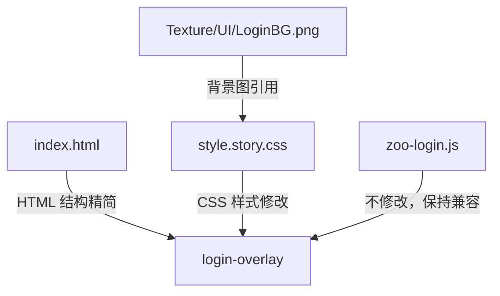

# Design Document: Login UI Optimization

## Overview

本设计对登录界面进行视觉优化，核心变更包括：

1. 将 `#login-overlay` 的背景从渐变+模糊替换为全屏背景图 `Texture/UI/LoginBG.png`
2. 精简 `.login-card` 内容，移除 kicker、title、desc 文字元素，仅保留输入框和登录按钮
3. 调整配色方案，使 UI 元素与背景图协调
4. 将登录卡片定位到屏幕底部，最大化背景图展示区域
5. 保持所有 JS 功能引用的 DOM ID 不变

本次优化仅涉及 CSS 样式修改和 HTML 结构精简，不涉及 JS 逻辑变更。

## Architecture

本次变更属于纯前端 UI 层优化，不涉及架构变更。变更范围限定在以下文件：



变更策略：
- **index.html**：移除 `.login-card-kicker`、`.login-card-title`、`.login-card-desc` 三个 HTML 元素；视觉隐藏 `#login-feedback`（保留 DOM 节点）
- **style.story.css**：修改 `.login-overlay` 背景样式；修改 `.login-card` 定位和配色；调整输入框和按钮配色
- **zoo-login.js**：不做任何修改

## Components and Interfaces

### 1. Login Overlay (`#login-overlay`)

**变更前：**
- `background`: radial-gradient + linear-gradient 渐变
- `backdrop-filter`: blur(10px)
- `align-items`: center（桌面端居中，移动端 flex-end）

**变更后：**
- `background`: url('Texture/UI/LoginBG.png') center/cover no-repeat
- 移除 `backdrop-filter` 和 `-webkit-backdrop-filter`
- `align-items`: flex-end（桌面端和移动端统一底部定位）
- 添加 `background-color` 作为图片加载前的 fallback

```css
.login-overlay {
    position: fixed;
    inset: 0;
    z-index: 20000;
    display: flex;
    align-items: flex-end;
    justify-content: center;
    padding: 24px;
    background: url('Texture/UI/LoginBG.png') center / cover no-repeat;
    background-color: #0b1324;
}
```

### 2. Login Card (`.login-card`)

**HTML 变更：**
移除以下元素：
- `<div class="login-card-kicker">今天也要开园呀</div>`
- `<h1 class="login-card-title">登录游戏</h1>`
- `<p class="login-card-desc">...</p>`

视觉隐藏（保留 DOM）：
- `#login-feedback`：添加 `sr-only` 风格隐藏，保持 `aria-live="polite"` 供 JS 使用

**CSS 变更：**
- 背景色调整为更透明的深色，让背景图隐约可见
- 底部安全边距：`margin-bottom: max(16px, env(safe-area-inset-bottom))`
- 减小 padding（内容减少后不需要那么多内边距）

```css
.login-card {
    width: min(100%, 420px);
    padding: 24px;
    border-radius: 20px;
    background: rgba(11, 19, 36, 0.72);
    border: 1px solid rgba(255, 255, 255, 0.08);
    box-shadow: 0 16px 40px rgba(0, 0, 0, 0.3);
    color: #fff;
    margin-bottom: max(16px, env(safe-area-inset-bottom));
}
```

### 3. 输入框样式调整

与背景图色调协调，使用偏暖的半透明色调：

```css
.login-field input {
    border: 1px solid rgba(255, 255, 255, 0.15);
    background: rgba(255, 255, 255, 0.08);
    border-radius: 14px;
}

.login-field input:focus {
    border-color: rgba(255, 220, 160, 0.8);
    box-shadow: 0 0 0 3px rgba(255, 200, 120, 0.15);
    background: rgba(255, 255, 255, 0.12);
}
```

### 4. 登录按钮样式调整

使用与背景图协调的暖色调渐变：

```css
.login-submit-btn {
    border-radius: 14px;
    background: linear-gradient(135deg, #f0a040, #e8783a);
    color: #fff;
    box-shadow: 0 8px 24px rgba(232, 120, 58, 0.3);
}
```

### 5. Feedback 元素视觉隐藏

```css
.login-feedback {
    position: absolute;
    width: 1px;
    height: 1px;
    padding: 0;
    margin: -1px;
    overflow: hidden;
    clip: rect(0, 0, 0, 0);
    white-space: nowrap;
    border: 0;
}
```

### 6. DOM ID 保留清单

以下 ID 必须保留在 DOM 中，确保 `zoo-login.js` 正常工作：

| DOM ID | 用途 | 变更 |
|--------|------|------|
| `#login-overlay` | 覆盖层容器 | 仅 CSS 变更 |
| `#login-form` | 表单提交 | 不变 |
| `#login-user-id` | 用户输入 | 不变 |
| `#login-submit-btn` | 提交按钮 | 仅 CSS 变更 |
| `#login-feedback` | 反馈文字 | 视觉隐藏，DOM 保留 |
| `#login-debug-toggle` | Debug 开关 | 不变 |
| `#login-debug-panel` | Debug 面板 | 不变 |
| `#login-loading` | 加载界面 | 不变 |

## Data Models

本次变更不涉及数据模型变更。所有修改限于 HTML 结构和 CSS 样式层面。


## Correctness Properties

*A property is a characteristic or behavior that should hold true across all valid executions of a system—essentially, a formal statement about what the system should do. Properties serve as the bridge between human-readable specifications and machine-verifiable correctness guarantees.*

大部分需求属于特定 CSS 样式检查和 DOM 结构验证（example 类型），只有 DOM ID 保留这一需求适合作为 property 测试——因为它是一个"对所有必需 ID"的通用规则。

### Property 1: 所有 JS 引用的 DOM ID 必须存在

*For any* DOM ID that is referenced by `zoo-login.js`（包括 `login-overlay`, `login-form`, `login-user-id`, `login-submit-btn`, `login-feedback`, `login-debug-toggle`, `login-debug-panel`, `login-debug-close`, `debug-user-id`, `debug-add-coin`, `debug-add-diamond`, `debug-add-ticket`, `debug-apply-btn`, `debug-feedback`, `login-loading`, `login-loading-fill`），该元素必须存在于 DOM 中。

**Validates: Requirements 5.1, 5.2, 5.3, 5.4**

## Error Handling

### 背景图加载失败

- `.login-overlay` 设置 `background-color: #0b1324` 作为 fallback，确保背景图加载失败时界面仍可用
- 背景色选择与原渐变背景的深色调一致，不会导致文字不可读

### DOM 元素缺失

- `zoo-login.js` 已有 null check 逻辑（`if (!refs.overlay || !refs.form || !refs.userIdInput) return;`），即使 HTML 结构变更导致元素缺失也不会抛出异常
- `setFeedback` 函数已有 `if (!element) return;` 保护，feedback 元素视觉隐藏不影响功能

### CSS 兼容性

- `env(safe-area-inset-bottom)` 在不支持的浏览器中会被忽略，`max()` 函数确保至少有 16px 的底部边距
- `background: url() center / cover` 是广泛支持的 CSS 语法，无兼容性风险

## Testing Strategy

### 单元测试（Example Tests）

针对具体的 CSS 样式和 DOM 结构进行验证：

1. **背景样式测试**：验证 `#login-overlay` 的 background-image 包含 `LoginBG.png`，background-size 为 `cover`，无 backdrop-filter
2. **DOM 结构精简测试**：验证 `.login-card` 内不存在 `.login-card-kicker`、`.login-card-title`、`.login-card-desc` 元素
3. **Feedback 隐藏测试**：验证 `#login-feedback` 存在于 DOM 但视觉不可见（clip/sr-only）
4. **底部定位测试**：验证 `#login-overlay` 的 align-items 为 `flex-end`（桌面端和移动端）
5. **卡片透明度测试**：验证 `.login-card` 的 background-color alpha 值小于 1
6. **Debug/Loading 保留测试**：验证 `#login-debug-panel` 和 `#login-loading` 及其子元素完整存在

### Property-Based Tests

使用 property-based testing 库（如 fast-check）验证通用属性：

- 每个 property test 至少运行 100 次迭代
- 每个 test 需标注对应的 design property
- 标注格式：**Feature: login-ui-optimization, Property {number}: {property_text}**

**Property 1 实现**：
- 从 `zoo-login.js` 中提取所有 `getElementById` 调用的 ID 列表
- 对列表中的每个 ID，验证 `document.getElementById(id)` 返回非 null
- 使用 fast-check 的 `fc.constantFrom()` 从 ID 列表中随机抽取进行验证
- Tag: **Feature: login-ui-optimization, Property 1: 所有 JS 引用的 DOM ID 必须存在**

### 手动验证

以下需求需要人工视觉验证，无法自动化测试：

- 配色方案与背景图的视觉协调性（Requirement 3.2, 3.3）
- 文字对比度在背景图上的可读性（Requirement 3.4）
- 不同设备和屏幕尺寸下的整体视觉效果
