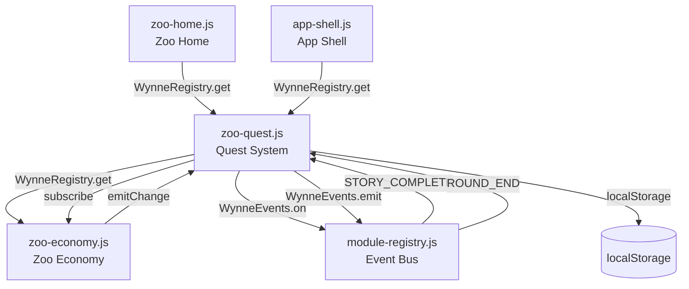
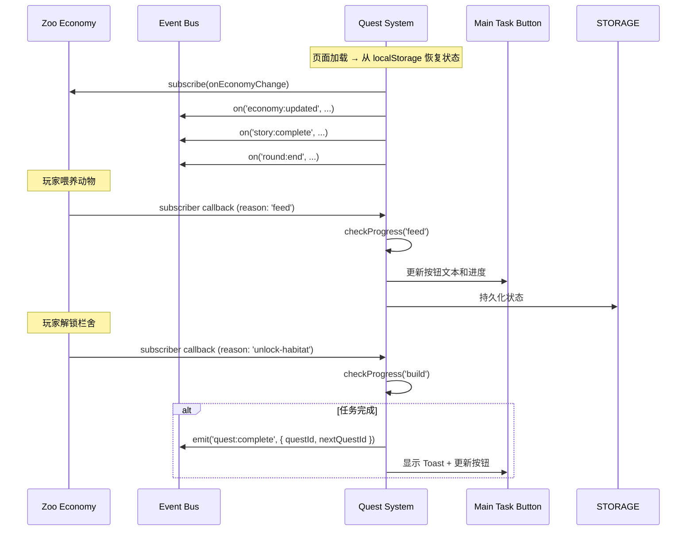

# 技术设计文档：主线任务系统

## 概述

主线任务系统（Quest System）是一个独立的 JavaScript 模块，为动物园经营游戏提供线性任务引导机制。该模块遵循项目现有的 IIFE 模块模式，通过 `WynneRegistry` 注册自身，通过 `WynneEvents` 事件总线监听游戏事件（喂养、建造、升级、剧情完成、盲盒挑战），驱动任务进度推进。任务进度持久化到 `localStorage`，UI 渲染复用现有的 `zoo-main-task-btn` 按钮。

核心设计决策：
- 采用与 `zoo-economy.js` 一致的 IIFE + 全局注册模式，而非 ES Module，保持项目一致性
- 通过订阅 `WynneZooEconomy` 的 `subscribe` 回调和 `WynneEvents` 事件总线双通道监听游戏事件，而非直接耦合其他模块
- 任务链定义为模块内静态常量数组，修改任务只需编辑数组，无需改动核心逻辑
- 任务激活时执行"追赶检查"（catch-up check），处理任务激活前已满足条件的情况

## 架构

### 模块依赖关系



### 事件流



## 组件与接口

### 文件结构

新增文件：`js/zoo/zoo-quest.js`

### 模块公开 API

```javascript
globalScope.WynneZooQuest = {
    /**
     * 获取当前任务系统的只读快照。
     * @returns {QuestSnapshot}
     */
    getSnapshot(),

    /**
     * 订阅任务状态变化。回调在每次状态变更时触发。
     * @param {Function} listener - (snapshot, { reason }) => void
     * @returns {Function} unsubscribe 函数
     */
    subscribe(listener),

    /**
     * 获取当前活跃任务的描述文本（供 zoo-home.js 渲染按钮用）。
     * @returns {string}
     */
    getActiveQuestText(),

    /**
     * 获取当前活跃任务的导航目标（供按钮点击跳转用）。
     * @returns {string|null} 'story' | 'slot' | 'habitat-panel' | null
     */
    getActiveQuestNavTarget(),

    /**
     * 手动触发追赶检查（用于模块延迟加载场景）。
     */
    recheckProgress()
};
```

### QuestSnapshot 结构

```javascript
{
    currentQuestId: number | null,   // 当前活跃任务 ID，全部完成时为 null
    currentQuest: {                  // 当前活跃任务详情，全部完成时为 null
        id: number,
        description: string,
        conditionType: string,       // 'feed' | 'build' | 'upgrade' | 'story' | 'blindbox'
        targetValue: number,
        progress: number,
        relatedId: string            // 关联的栏舍 ID 或剧情 ID
    } | null,
    completedQuestIds: number[],     // 已完成的任务 ID 列表
    allCompleted: boolean,           // 是否全部完成
    totalQuests: number              // 任务总数
}
```

### 与现有模块的集成点

1. **zoo-home.js**：通过 `WynneRegistry.get('WynneZooQuest')` 获取模块，调用 `getActiveQuestText()` 渲染按钮文本，调用 `getActiveQuestNavTarget()` 处理按钮点击导航
2. **zoo-economy.js**：Quest System 通过 `economy.subscribe()` 监听状态变化，通过 `economy.getSnapshot()` 读取栏舍解锁/升级状态和剧情标记
3. **app-shell.js**：Quest System 通过 `getActiveQuestNavTarget()` 返回导航目标，app-shell 负责实际的屏幕切换

## 数据模型

### 任务链静态配置（QUEST_CHAIN）

```javascript
const QUEST_CHAIN = Object.freeze([
    {
        id: 1,
        description: '喂养小熊猫 1 次',
        conditionType: 'feed',
        targetValue: 1,
        relatedId: 'red-panda',
        navTarget: 'habitat-panel'
    },
    {
        id: 2,
        description: '完成第一章剧情',
        conditionType: 'story',
        targetValue: 1,
        relatedId: '第一章',
        navTarget: 'story'
    },
    {
        id: 3,
        description: '进行 1 次盲盒挑战',
        conditionType: 'blindbox',
        targetValue: 1,
        relatedId: '',
        navTarget: 'slot'
    },
    {
        id: 4,
        description: '建造小熊猫栏舍',
        conditionType: 'build',
        targetValue: 1,
        relatedId: 'red-panda',
        navTarget: 'habitat-panel'
    },
    {
        id: 5,
        description: '升级小熊猫栏舍',
        conditionType: 'upgrade',
        targetValue: 1,
        relatedId: 'red-panda',
        navTarget: 'habitat-panel'
    },
    {
        id: 6,
        description: '再喂养小熊猫 3 次',
        conditionType: 'feed',
        targetValue: 3,
        relatedId: 'red-panda',
        navTarget: 'habitat-panel'
    }
]);
```

> 注：以上为示例任务链，具体任务内容可在后续迭代中调整。任务 ID 为递增整数，顺序即为解锁顺序。

### 运行时状态（持久化到 localStorage）

```javascript
{
    version: 1,                      // 存档版本号，用于未来迁移
    currentQuestId: number | null,   // 当前活跃任务 ID
    completedQuestIds: number[],     // 已完成任务 ID 数组
    progress: number                 // 当前任务的累计进度值
}
```

### localStorage 键名规则

```
wynnesZoo.quest.user.{userId}
```

与 `zoo-economy.js` 的 `wynnesZoo.zooEconomy.user.{userId}` 保持一致的命名模式，`userId` 通过 `WynneZooEconomy.getActiveUserId()` 获取。


### 核心函数签名与算法

#### 初始化流程

```javascript
function initQuestSystem(globalScope) {
    // 1. 获取依赖模块
    const economy = globalScope.WynneZooEconomy || null;
    const Events = globalScope.WynneEvents || null;

    // 2. 从 localStorage 加载状态
    let runtimeState = loadState(economy);

    // 3. 执行追赶检查（处理离线期间已满足的条件）
    catchUpCheck(economy);

    // 4. 订阅经济系统变化
    if (economy) {
        economy.subscribe(onEconomyChange);
    }

    // 5. 监听事件总线
    if (Events) {
        Events.on(Events.EVENTS.STORY_COMPLETE, onStoryComplete);
        Events.on(Events.EVENTS.ROUND_END, onRoundEnd);
    }

    // 6. 初始渲染 UI
    renderQuestUI();

    // 7. 注册模块
    globalScope.WynneRegistry.register('WynneZooQuest', api);
}
```

#### 进度检查核心算法

```javascript
/**
 * 当经济系统状态变化时调用。
 * 根据 reason 判断是否与当前任务相关，更新进度。
 */
function onEconomyChange(snapshot, { reason }) {
    const quest = getActiveQuest();
    if (!quest) return; // 全部完成

    switch (quest.conditionType) {
        case 'feed':
            if (reason === 'feed') {
                runtimeState.progress += 1;
            }
            break;
        case 'build':
            if (reason === 'unlock-habitat') {
                checkBuildCondition(snapshot, quest);
            }
            break;
        case 'upgrade':
            if (reason === 'upgrade-tier') {
                checkUpgradeCondition(snapshot, quest);
            }
            break;
    }

    checkCompletion();
}

/**
 * 检查当前任务是否完成，若完成则推进到下一个任务。
 */
function checkCompletion() {
    const quest = getActiveQuest();
    if (!quest) return;

    if (runtimeState.progress >= quest.targetValue) {
        completeCurrentQuest();
    } else {
        persistState();
        renderQuestUI();
    }
}

/**
 * 完成当前任务，推进到下一个。
 */
function completeCurrentQuest() {
    const quest = getActiveQuest();
    runtimeState.completedQuestIds.push(quest.id);

    const nextQuest = getQuestById(quest.id + 1);
    if (nextQuest) {
        runtimeState.currentQuestId = nextQuest.id;
        runtimeState.progress = 0;
        // 对新任务执行追赶检查
        catchUpCheck(globalScope.WynneZooEconomy);
    } else {
        runtimeState.currentQuestId = null;
    }

    persistState();
    renderQuestUI();
    emitQuestComplete(quest);
    showCompletionToast(quest);
}
```

#### 追赶检查算法（Catch-up Check）

处理任务激活前已满足条件的场景（如小熊猫栏舍在任务激活前已被解锁）：

```javascript
/**
 * 检查当前活跃任务是否在激活时已满足条件。
 * 对于 build/upgrade 类型，检查经济系统快照中的栏舍状态。
 * 对于 story 类型，检查已完成的剧情标记。
 */
function catchUpCheck(economy) {
    const quest = getActiveQuest();
    if (!quest || !economy) return;

    const snapshot = economy.getSnapshot();

    switch (quest.conditionType) {
        case 'build': {
            const habitat = findHabitatById(snapshot, quest.relatedId);
            if (habitat && habitat.unlocked) {
                runtimeState.progress = quest.targetValue;
            }
            break;
        }
        case 'upgrade': {
            const habitat = findHabitatById(snapshot, quest.relatedId);
            if (habitat && habitat.unlocked && habitat.tier
                && habitat.tier.id !== 'standard') {
                runtimeState.progress = quest.targetValue;
            }
            break;
        }
        case 'story': {
            const storyFlags = snapshot.storyFlags || {};
            const completedCount = countCompletedStories(storyFlags, quest.relatedId);
            runtimeState.progress = Math.max(runtimeState.progress, completedCount);
            break;
        }
    }

    checkCompletion();
}
```

#### UI 渲染

```javascript
/**
 * 更新左下角任务按钮的文本内容。
 * 直接操作 DOM 元素 #zoo-main-task-text。
 */
function renderQuestUI() {
    const textEl = document.getElementById('zoo-main-task-text');
    if (!textEl) return;

    const quest = getActiveQuest();
    if (!quest) {
        textEl.textContent = '主线任务已全部完成';
        return;
    }

    // 对于有进度的任务（feed/story/blindbox），显示进度
    if (['feed', 'story', 'blindbox'].includes(quest.conditionType)) {
        textEl.textContent = `${quest.description}（${runtimeState.progress}/${quest.targetValue}）`;
    } else {
        textEl.textContent = quest.description;
    }
}
```

#### 持久化

```javascript
const STORAGE_PREFIX = 'wynnesZoo.quest.user.';

function getStorageKey() {
    const economy = globalScope.WynneZooEconomy;
    const userId = economy && typeof economy.getActiveUserId === 'function'
        ? economy.getActiveUserId()
        : '';
    return userId ? `${STORAGE_PREFIX}${encodeURIComponent(userId)}` : '';
}

function persistState() {
    const key = getStorageKey();
    if (!key) return;
    try {
        globalScope.localStorage.setItem(key, JSON.stringify(runtimeState));
    } catch (e) { /* noop */ }
}

function loadState(economy) {
    const key = getStorageKey();
    if (!key) return createDefaultState();
    try {
        const raw = JSON.parse(globalScope.localStorage.getItem(key));
        return normalizeState(raw);
    } catch (e) {
        return createDefaultState();
    }
}

function createDefaultState() {
    return {
        version: 1,
        currentQuestId: QUEST_CHAIN[0].id,
        completedQuestIds: [],
        progress: 0
    };
}
```


## 正确性属性（Correctness Properties）

*属性（Property）是指在系统所有合法执行路径中都应成立的特征或行为——本质上是对系统应做之事的形式化陈述。属性是连接人类可读规格说明与机器可验证正确性保证之间的桥梁。*

### Property 1: 任务链 ID 唯一且有序

*For any* Quest_Chain 配置数组，其中所有 Quest 的 id 字段应互不相同，且按严格递增顺序排列。

**Validates: Requirements 2.1**

### Property 2: 完成当前任务自动推进到下一个

*For any* 非末尾位置的活跃 Quest，当该 Quest 被标记为已完成时，系统状态中的 currentQuestId 应等于 Quest_Chain 中下一个 Quest 的 id，且 progress 应重置为 0。

**Validates: Requirements 2.2**

### Property 3: 单一活跃任务不变量

*For any* 任务系统状态，以下不变量应始终成立：completedQuestIds 中的所有 id 均小于 currentQuestId（若 currentQuestId 非 null），且 completedQuestIds 中无重复元素。当 currentQuestId 为 null 时，completedQuestIds 应包含 Quest_Chain 中所有 Quest 的 id。

**Validates: Requirements 2.3, 2.4, 2.5**

### Property 4: 匹配事件递增进度

*For any* 活跃 Quest 及其 conditionType，当系统接收到与该 conditionType 匹配的事件（feed 事件对应 feed 类型，story:complete 对应 story 类型，round:end 对应 blindbox 类型）时，progress 应恰好增加 1。

**Validates: Requirements 3.1, 6.1, 7.1**

### Property 5: 不匹配事件不改变进度

*For any* 活跃 Quest，当系统接收到与该 Quest 的 conditionType 不匹配的事件时，progress 应保持不变。

**Validates: Requirements 3.3, 7.4**

### Property 6: 进度达标即完成

*For any* 活跃 Quest，当 progress 达到或超过该 Quest 的 targetValue 时，该 Quest 应被移入 completedQuestIds，且系统应推进到下一个 Quest（或标记全部完成）。

**Validates: Requirements 3.2**

### Property 7: 追赶检查正确初始化进度

*For any* 新激活的 Quest，如果经济系统快照中已满足该 Quest 的完成条件（build 类型的栏舍已解锁、upgrade 类型的栏舍已升级、story 类型的章节已完成），则 catch-up check 应将 progress 设置为不小于 targetValue 的值，从而触发自动完成。

**Validates: Requirements 4.1, 4.3, 5.1, 5.3, 6.4**

### Property 8: 状态持久化往返一致性

*For any* 合法的任务系统运行时状态，将其序列化到 localStorage 后再反序列化，应得到与原始状态等价的对象（version、currentQuestId、completedQuestIds、progress 均相同）。

**Validates: Requirements 8.1, 8.2**

### Property 9: 用户存储键隔离

*For any* 两个不同的 userId 字符串，生成的 localStorage 键应互不相同。

**Validates: Requirements 8.3**

### Property 10: UI 文本反映当前状态

*For any* 任务系统状态，getActiveQuestText() 的返回值应包含当前活跃 Quest 的 description 文本；若所有 Quest 已完成，则应返回"主线任务已全部完成"。

**Validates: Requirements 9.1, 9.2, 10.3**

### Property 11: 导航目标与任务类型映射

*For any* 活跃 Quest，getActiveQuestNavTarget() 的返回值应与该 Quest 的 conditionType 对应：feed/build/upgrade → 'habitat-panel'，story → 'story'，blindbox → 'slot'。

**Validates: Requirements 9.3**

### Property 12: 完成事件发射

*For any* Quest 完成操作，Event_Bus 应收到一个 'quest:complete' 事件，其 payload 中包含已完成 Quest 的 id。

**Validates: Requirements 10.1**

### Property 13: Quest 数据结构完整性

*For any* Quest_Chain 中的 Quest 对象，应包含以下非空字段：id（正整数）、description（非空字符串）、conditionType（枚举值之一）、targetValue（正整数）。

**Validates: Requirements 11.2**

## 错误处理

| 场景 | 处理策略 |
|------|---------|
| localStorage 读取失败 | 静默降级，使用默认初始状态（第一个任务为活跃） |
| localStorage 写入失败 | 静默忽略，内存中状态仍然正确，下次写入时重试 |
| 存档数据格式异常 | `normalizeState()` 函数修正非法值，确保状态始终合法 |
| WynneZooEconomy 未加载 | 模块正常初始化但不监听经济事件，等待经济模块就绪后手动 recheckProgress |
| WynneEvents 未加载 | 模块正常初始化但不监听事件总线事件，仅通过经济系统 subscribe 回调工作 |
| Quest_Chain 为空数组 | 直接标记为全部完成状态 |
| 存档版本号不匹配 | 执行版本迁移逻辑，当前仅 version 1，预留迁移入口 |

## 测试策略

### 双轨测试方法

本模块采用单元测试 + 属性测试（Property-Based Testing）双轨并行的测试策略。

### 属性测试（Property-Based Testing）

- 测试库：**fast-check**（JavaScript 生态中成熟的 PBT 库）
- 每个属性测试最少运行 **100 次迭代**
- 每个测试用注释标注对应的设计文档属性编号
- 标注格式：`// Feature: main-quest-system, Property {N}: {property_text}`
- 每个正确性属性由**单个**属性测试实现

### 属性测试覆盖范围

| 属性编号 | 测试描述 | 生成器 |
|---------|---------|--------|
| Property 1 | 验证 QUEST_CHAIN 的 ID 唯一性和有序性 | 生成随机长度的任务链 |
| Property 2 | 验证完成任务后自动推进 | 生成随机任务位置 |
| Property 3 | 验证单一活跃任务不变量 | 生成随机操作序列后检查不变量 |
| Property 4 | 验证匹配事件递增进度 | 生成随机 conditionType 和匹配事件 |
| Property 5 | 验证不匹配事件不改变进度 | 生成随机 conditionType 和不匹配事件 |
| Property 6 | 验证进度达标触发完成 | 生成随机 targetValue 和 progress |
| Property 7 | 验证追赶检查 | 生成随机预设状态的经济系统快照 |
| Property 8 | 验证序列化/反序列化往返一致性 | 生成随机合法状态对象 |
| Property 9 | 验证用户存储键隔离 | 生成随机 userId 对 |
| Property 10 | 验证 UI 文本反映状态 | 生成随机任务状态 |
| Property 11 | 验证导航目标映射 | 生成随机 conditionType |
| Property 12 | 验证完成事件发射 | 生成随机任务完成场景 |
| Property 13 | 验证数据结构完整性 | 生成随机 Quest 对象 |

### 单元测试覆盖范围

单元测试聚焦于具体示例、边界情况和集成点：

- 默认状态初始化（localStorage 为空时第一个任务为活跃）
- 全部任务完成后 UI 显示"主线任务已全部完成"
- 存档版本迁移
- 模块注册到 WynneRegistry
- 按钮点击导航到正确界面
- Toast 提示包含已完成任务名称
