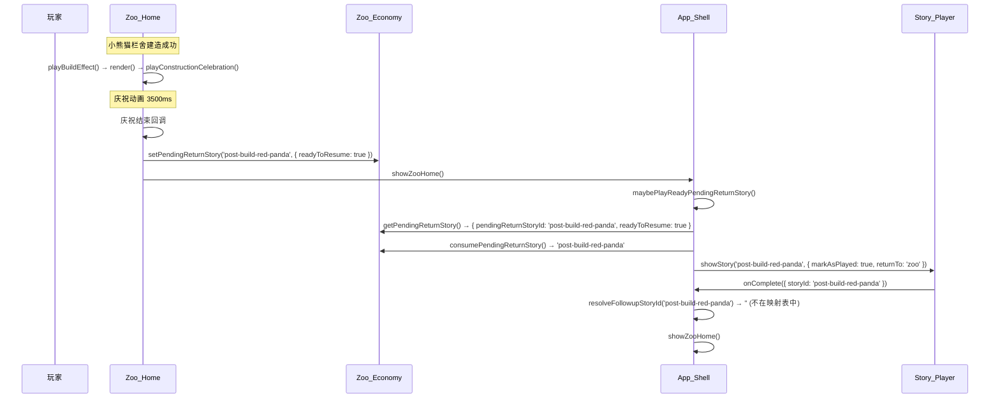

# 技术设计文档：建造后特殊剧情

## 概述

本设计实现两个核心变更：

1. 将 `resolveFollowupStoryId` 中的主线章节衔接逻辑从"按注册顺序取下一个"改为显式映射表查询，确保新增的特殊剧情不会被误当成主线的下一章。
2. 在小熊猫栏舍（`red-panda-grove`）首次建造完成后，通过现有的 `setPendingReturnStory` 机制触发一段独立特殊剧情的播放。

变更范围涉及 4 个文件，无需新增模块或引入新依赖。

## 架构

### 整体流程



### 变更文件清单

| 文件 | 变更内容 |
|------|---------|
| `js/app-shell.js` | 新增 `MAIN_STORY_SEQUENCE` 映射表，重写 `resolveFollowupStoryId` 逻辑 |
| `js/story/story-generated-data.js` | 在 `WynneImportedStories` 中新增特殊剧情条目 |
| `js/zoo/zoo-home.js` | 在 `startHabitatConstruction` 中，庆祝结束后触发特殊剧情设置 |
| `js/story/story-data.js` | 无变更（`getNextStoryId` 保留但不再被 `resolveFollowupStoryId` 调用） |

## 组件与接口

### 1. 主线章节映射表（app-shell.js）

在 `resolveFollowupStoryId` 函数上方定义一个静态映射对象：

```javascript
const MAIN_STORY_SEQUENCE = {
    'prologue': '第一章',
    '第一章': '第二章',
    '第二章': '第三章'
};
```

重写 `resolveFollowupStoryId`：

```javascript
function resolveFollowupStoryId(storyId) {
    const targetId = String(storyId || '').trim();
    const nextId = MAIN_STORY_SEQUENCE[targetId] || '';
    if (nextId && hasPlayableStory(nextId)) {
        return nextId;
    }
    return '';
}
```

变更要点：
- 不再调用 `storyData.getNextStoryId()`，完全依赖映射表
- 移除原有的 `ENTRY_STORY_ID → FIRST_CHAPTER_ID` 硬编码 fallback（已被映射表覆盖）
- 特殊剧情 storyId 不在映射表中 → 自然返回空字符串 → 播完后回到动物园主页

### 2. 特殊剧情数据（story-generated-data.js）

在 `WynneImportedStories` 对象中新增条目，storyId 为 `post-build-red-panda`：

```javascript
"post-build-red-panda": {
    "version": 1,
    "storyId": "post-build-red-panda",
    "title": "新家落成",
    "stage": {
        "maxActorsPerBeat": 2,
        "singleActorPosition": "center",
        "doubleActorPositions": ["left", "right"]
    },
    "characters": [...],  // 复用现有角色定义
    "beats": [...]         // 具体剧情节拍，由策划提供
}
```

约束：
- `storyId` 值 `post-build-red-panda` 不出现在 `MAIN_STORY_SEQUENCE` 的键或值中
- 数据结构与现有剧情条目完全一致，无需 schema 变更

### 3. 建造完成触发逻辑（zoo-home.js）

修改 `startHabitatConstruction` 函数，在庆祝动画结束后设置待返回剧情：

```javascript
function startHabitatConstruction(habitatId) {
    if (!economy || typeof economy.beginHabitatConstruction !== 'function') {
        return null;
    }

    closePanel();
    closeStoryPreviewPanel();
    const result = economy.beginHabitatConstruction(habitatId);
    if (result) {
        if (result.ok) {
            const isFirstBuild = result.isNew !== false; // beginHabitatConstruction 返回 isNew 标识
            playBuildEffect(function () {
                render();
                playConstructionCelebration(habitatId);
                // 小熊猫栏舍首次建造完成后，设置特殊剧情
                if (habitatId === 'red-panda-grove' && isFirstBuild) {
                    globalScope.setTimeout(function () {
                        if (economy && typeof economy.setPendingReturnStory === 'function') {
                            economy.setPendingReturnStory('post-build-red-panda', {
                                readyToResume: true
                            });
                        }
                        var appShell = globalScope.WynneZooAppShell
                            || (globalScope.WynneRegistry && globalScope.WynneRegistry.get('WynneZooAppShell'));
                        if (appShell && typeof appShell.showZooHome === 'function') {
                            appShell.showZooHome();
                        }
                    }, 3500); // 与庆祝动画时长一致
                }
            });
        } else {
            showToast(result.message, 'warn');
            render();
        }
    }
    return result;
}
```

关键设计决策：
- 使用 `setTimeout(3500)` 等待庆祝动画完成后再触发，避免动画被打断
- 通过 `result.isNew` 区分首次建造和升级（`beginHabitatConstruction` 已返回此字段）
- 仅硬编码 `red-panda-grove` 这一个栏舍 ID，因为当前只有这一个特殊剧情触发点
- 设置 `readyToResume: true` 后立即调用 `showZooHome()`，由 `maybePlayReadyPendingReturnStory` 自动消费并播放

### 4. 现有接口复用

以下接口无需修改，直接复用：

| 接口 | 模块 | 用途 |
|------|------|------|
| `setPendingReturnStory(storyId, options)` | Zoo_Economy | 设置待播放剧情 |
| `getPendingReturnStory()` | Zoo_Economy | 查询待播放剧情状态 |
| `consumePendingReturnStory()` | Zoo_Economy | 消费并返回待播放剧情 ID |
| `maybePlayReadyPendingReturnStory()` | App_Shell | 在 showZooHome 中自动检查并播放 |
| `hasPlayableStory(storyId)` | App_Shell | 检查剧情是否可播放 |

## 数据模型

### 主线章节映射表

```typescript
// 类型描述（实际代码为纯 JS 对象）
type MainStorySequence = Record<string, string>;

// 示例
const MAIN_STORY_SEQUENCE: MainStorySequence = {
    'prologue': '第一章',
    '第一章': '第二章',
    '第二章': '第三章'
};
```

映射表是一个简单的键值对象：
- 键：当前章节的 storyId
- 值：下一章节的 storyId
- 不在映射表中的 storyId → 没有后续主线章节

### 特殊剧情条目

沿用现有剧情数据结构，无新增字段：

```typescript
interface StoryEntry {
    version: number;
    storyId: string;
    title: string;
    stage: {
        maxActorsPerBeat: number;
        singleActorPosition: string;
        doubleActorPositions: string[];
    };
    characters: Character[];
    beats: Beat[];
}
```

### 待返回剧情状态（已有，无变更）

```typescript
interface PendingReturnStoryFlow {
    pendingReturnStoryId: string;
    pendingGuideSpeciesId: string;
    readyToResume: boolean;
}
```

特殊剧情使用时：`{ pendingReturnStoryId: 'post-build-red-panda', pendingGuideSpeciesId: '', readyToResume: true }`


## 正确性属性（Correctness Properties）

*属性（Property）是指在系统所有合法执行路径中都应成立的特征或行为——本质上是对系统应做什么的形式化陈述。属性是人类可读规格说明与机器可验证正确性保证之间的桥梁。*

### Property 1: 映射表内的 storyId 返回正确的下一章

*For any* storyId 存在于主线章节映射表中，且映射目标剧情可播放，`resolveFollowupStoryId` 应返回映射表中对应的目标 storyId，且该结果与剧情注册表中的注册顺序无关。

**Validates: Requirements 1.2, 1.4**

### Property 2: 映射表外的 storyId 返回空字符串

*For any* storyId 不存在于主线章节映射表的键中，`resolveFollowupStoryId` 应返回空字符串，无论该 storyId 是否对应一个可播放的剧情。

**Validates: Requirements 1.3, 4.1**

## 错误处理

### 边界情况

| 场景 | 处理方式 |
|------|---------|
| `resolveFollowupStoryId` 传入 `null`/`undefined`/空字符串 | `String(storyId \|\| '').trim()` 归一化后在映射表中查不到，返回空字符串 |
| 映射表中的目标剧情尚未加载（`hasPlayableStory` 返回 false） | 返回空字符串，玩家回到动物园主页 |
| `setPendingReturnStory` 调用时 `economy` 对象不可用 | `typeof economy.setPendingReturnStory === 'function'` 守卫检查，静默跳过 |
| 庆祝动画期间玩家快速操作 | `setTimeout(3500)` 确保在动画完成后才触发剧情设置 |
| `red-panda-grove` 升级时误触发 | 通过 `result.isNew` 标识区分首次建造和升级 |
| `showZooHome` 调用时 `maybePlayReadyPendingReturnStory` 未找到待播放剧情 | 正常显示动物园主页，无副作用 |

### 防御性编程

- 所有外部模块引用（`economy`、`appShell`）在调用前进行 `typeof` 检查
- `storyId` 始终通过 `String(x || '').trim()` 归一化
- 映射表使用 `||` 运算符提供默认空字符串，避免 `undefined` 传播

## 测试策略

### 双重测试方法

本功能采用单元测试 + 属性测试的双重策略：

- **属性测试**：验证 `resolveFollowupStoryId` 在所有输入上的通用行为
- **单元测试**：验证具体场景、边界情况和集成点

### 属性测试

使用 [fast-check](https://github.com/dubzzz/fast-check) 作为属性测试库。

每个属性测试至少运行 100 次迭代，使用随机生成的 storyId 输入。

每个属性测试必须通过注释引用设计文档中的属性编号：

```javascript
// Feature: post-build-story, Property 1: 映射表内的 storyId 返回正确的下一章
// Feature: post-build-story, Property 2: 映射表外的 storyId 返回空字符串
```

每个正确性属性由一个属性测试实现。

### 单元测试

单元测试覆盖以下具体场景：

1. **映射表结构验证**（Requirements 1.1）：验证 `MAIN_STORY_SEQUENCE` 包含 `prologue → 第一章`、`第一章 → 第二章` 等预期条目
2. **特殊剧情数据验证**（Requirements 2.1, 2.2, 2.3）：验证 `post-build-red-panda` 条目存在、字段完整、且 storyId 不在映射表中
3. **建造触发集成测试**（Requirements 3.1, 3.2）：模拟 `red-panda-grove` 建造成功，验证 `setPendingReturnStory` 被正确调用
4. **升级不触发**（Requirements 3.3）：模拟栏舍升级，验证不触发特殊剧情设置
5. **特殊剧情播完回到主页**（Requirements 4.2）：模拟特殊剧情 onComplete，验证调用 `showZooHome()`
6. **主线进度不受影响**（Requirements 4.3）：播放特殊剧情前后，主线 storyFlags 保持不变
