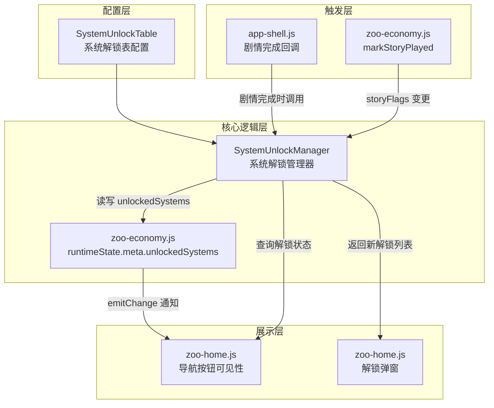

# 设计文档：系统解锁功能

## 概述

系统解锁功能为游戏引入一套基于剧情进度的子系统渐进式开放机制。当玩家完成（或跳过）指定幕的剧情后，对应的系统（如"动物图鉴"、"动物远行"等）将自动解锁，主界面导航按钮随之可见，并弹出解锁通知弹窗。

该功能的核心设计目标：
- 可扩展：新增系统解锁条目只需在配置数组中追加一条记录
- 与现有架构一致：复用 `zoo-economy.js` 的 `runtimeState` + `emitChange()` + `localStorage` 持久化模式
- 向后兼容：已有玩家首次加载时自动根据 `storyFlags` 补偿解锁

### 关键设计决策

1. **解锁管理器作为独立模块**：新建 `js/zoo/system-unlock.js`，以 IIFE 模式注册到 `window.WynneRegistry`，与现有模块风格一致
2. **状态存储在 zoo-economy 的 runtimeState 中**：在 `runtimeState.meta` 下新增 `unlockedSystems` 字段，复用现有的 `saveStateForUser` / `loadStateForUser` 持久化链路
3. **章节ID映射内置于解锁管理器**：`chapterId → storyId` 的映射逻辑（0→"prologue"，1→"第一章"等）封装在解锁管理器内部
4. **弹窗由 zoo-home 负责渲染**：解锁管理器只负责计算"待展示的解锁通知队列"，弹窗 UI 由 `zoo-home.js` 在 `onShow` 时消费

## 架构



### 数据流

1. 玩家完成/跳过剧情 → `app-shell.js` 的 `onComplete` 回调触发
2. 回调中调用 `SystemUnlockManager.checkAndUnlock(storyId)` 
3. 解锁管理器读取解锁表，将 `chapterId` 映射为 `storyId`，与当前完成的 `storyId` 比对
4. 匹配的系统写入 `runtimeState.meta.unlockedSystems`，通过 `emitChange()` 持久化并通知订阅者
5. 返回主界面时，`zoo-home.js` 的 `onShow` 中：
   - 调用解锁管理器获取"待展示通知队列"
   - 依次弹出解锁弹窗
   - 根据解锁状态刷新导航按钮可见性

## 组件与接口

### 1. SystemUnlockTable（系统解锁表配置）

定义在 `config/game-config.js` 或独立配置文件中，作为 `window.APP_CONFIG.systemUnlockTable` 导出。

```javascript
window.APP_CONFIG.systemUnlockTable = [
    {
        systemId: 'collection',        // 系统唯一标识
        systemName: '动物图鉴',         // 系统显示名称
        iconSrc: './Texture/UI/Icon_System_Collection.png', // 系统图标路径
        chapterId: 0,                   // 解锁所需章节ID
        beatIndex: 2,                   // 解锁所需幕索引
        navElementId: 'zoo-nav-collection' // 对应导航按钮的 DOM ID
    },
    // 后续可追加更多条目
    // {
    //     systemId: 'trip',
    //     systemName: '动物远行',
    //     iconSrc: './Texture/UI/Icon_System_Trip.png',
    //     chapterId: 1,
    //     beatIndex: 0,
    //     navElementId: 'zoo-nav-trip'
    // }
];
```

### 2. SystemUnlockManager（系统解锁管理器）

文件：`js/zoo/system-unlock.js`

```javascript
// 公开 API
window.WynneSystemUnlock = {
    /**
     * 检查并解锁满足条件的系统
     * @param {string} completedStoryId - 刚完成的剧情 storyId
     * @returns {{ newlyUnlocked: Array<{systemId, systemName, iconSrc}> }}
     */
    checkAndUnlock(completedStoryId),

    /**
     * 根据已有 storyFlags 补偿解锁所有满足条件的系统
     * @returns {{ newlyUnlocked: Array<{systemId, systemName, iconSrc}> }}
     */
    syncFromStoryFlags(),

    /**
     * 查询某系统是否已解锁
     * @param {string} systemId
     * @returns {boolean}
     */
    isUnlocked(systemId),

    /**
     * 获取所有系统的解锁状态
     * @returns {Array<{systemId, systemName, iconSrc, unlocked: boolean}>}
     */
    getAllStatus(),

    /**
     * 获取待展示的解锁通知队列（未展示过的）
     * @returns {Array<{systemId, systemName, iconSrc}>}
     */
    getPendingNotifications(),

    /**
     * 标记某解锁通知为已展示
     * @param {string} systemId
     */
    markNotificationShown(systemId),

    /**
     * 将 chapterId 映射为 storyId
     * @param {number} chapterId
     * @returns {string}
     */
    mapChapterToStoryId(chapterId)
};
```

### 3. zoo-economy.js 扩展

在 `runtimeState.meta` 中新增字段：

```javascript
runtimeState.meta.unlockedSystems = {
    // systemId → { unlockedAt: timestamp, notificationShown: boolean }
    'collection': { unlockedAt: 1700000000000, notificationShown: true }
};
```

需要修改的函数：
- `normalizeState()`：增加 `meta.unlockedSystems` 的规范化逻辑
- `getSnapshot()`：在快照中包含 `unlockedSystems` 数据

### 4. zoo-home.js 扩展

- `onShow()` 中增加：调用 `getPendingNotifications()` 获取待展示通知，依次弹出解锁弹窗
- `render()` 或 `init()` 中增加：根据解锁状态控制导航按钮的 `hidden` 属性
- 新增解锁弹窗的 DOM 结构和渲染逻辑

### 5. app-shell.js 扩展

在 `showStory` 的 `onComplete` 回调中，调用 `SystemUnlockManager.checkAndUnlock(targetStoryId)`。

### 6. 导航按钮与 systemId 的映射

通过解锁表中的 `navElementId` 字段建立映射：

| systemId    | navElementId        | 按钮文案   |
|-------------|---------------------|-----------|
| collection  | zoo-nav-collection  | 动物图鉴   |
| trip        | zoo-nav-trip        | 动物远行   |

## 数据模型

### 系统解锁表条目（SystemUnlockEntry）

| 字段          | 类型     | 说明                                    |
|---------------|----------|-----------------------------------------|
| systemId      | string   | 系统唯一标识，如 `'collection'`          |
| systemName    | string   | 系统显示名称，如 `'动物图鉴'`            |
| iconSrc       | string   | 系统图标资源路径                         |
| chapterId     | number   | 解锁所需章节ID（0=序章，1=第一章...）     |
| beatIndex     | number   | 解锁所需幕索引（从0开始）                |
| navElementId  | string   | 对应主界面导航按钮的 DOM 元素 ID          |

### 解锁状态记录（UnlockedSystemRecord）

存储在 `runtimeState.meta.unlockedSystems[systemId]` 中：

| 字段              | 类型     | 说明                          |
|-------------------|----------|-------------------------------|
| unlockedAt        | number   | 解锁时间戳（毫秒）             |
| notificationShown | boolean  | 解锁弹窗是否已展示             |

### 章节ID到剧情ID的映射规则

```
chapterId 0  → "prologue"
chapterId 1  → "第一章"
chapterId 2  → "第二章"
chapterId N  → "第N章"  (N >= 2)
```

特殊情况：`chapterId === 0` 固定映射为 `"prologue"`，其余按 `"第{N}章"` 格式生成。

### 解锁条件匹配逻辑

对于解锁表中的每个条目：
1. 将 `chapterId` 映射为 `storyId`
2. 检查 `storyFlags[storyId]` 是否为 `true`（表示该章节已完成）
3. 如果已完成，检查该章节的 beats 数量是否 > `beatIndex`（确保该幕存在）
4. 条件满足则标记为已解锁

简化判断：由于 `storyFlags` 是按整个 story 标记完成的（不是按 beat），当 `storyFlags[storyId] === true` 时，意味着该 story 的所有 beats 都已完成，因此只需检查 `storyFlags[storyId]` 即可。


## 正确性属性（Correctness Properties）

*属性（Property）是指在系统所有合法执行路径中都应成立的特征或行为——本质上是对系统应做什么的形式化陈述。属性是人类可读规格说明与机器可验证正确性保证之间的桥梁。*

### Property 1: 配置验证完整性

*For any* 系统解锁表条目，该条目必须包含 `systemId`（非空字符串）、`systemName`（非空字符串）、`iconSrc`（非空字符串）、`chapterId`（非负整数）、`beatIndex`（非负整数）和 `navElementId`（非空字符串）六个字段，且解锁管理器能正确读取并返回所有条目。

**Validates: Requirements 1.1, 1.2, 4.4**

### Property 2: 章节ID到剧情ID的映射正确性

*For any* 非负整数 `chapterId`，`mapChapterToStoryId(chapterId)` 应满足：当 `chapterId === 0` 时返回 `"prologue"`；当 `chapterId >= 1` 时返回 `"第{chapterId}章"`。

**Validates: Requirements 1.4**

### Property 3: 解锁条件匹配与状态更新

*For any* 系统解锁表和任意 `storyFlags` 状态，当调用 `checkAndUnlock(storyId)` 时，所有 `chapterId` 映射后等于 `storyId` 且 `storyFlags[storyId] === true` 的条目对应的系统都应被标记为已解锁，且不影响其他系统的解锁状态。

**Validates: Requirements 2.1, 2.2, 2.5**

### Property 4: 解锁状态持久化往返

*For any* 已解锁的系统集合，将解锁状态序列化存储后再反序列化恢复，恢复后的解锁状态应与存储前完全一致。

**Validates: Requirements 2.3, 5.1, 5.2**

### Property 5: 解锁操作幂等性

*For any* 已处于解锁状态的系统，再次调用解锁操作后，`unlockedSystems` 的状态（包括 `unlockedAt` 时间戳和 `notificationShown` 标记）应与调用前完全相同。

**Validates: Requirements 2.4**

### Property 6: 通知标记消除

*For any* 系统 `systemId`，调用 `markNotificationShown(systemId)` 后，`getPendingNotifications()` 返回的列表中不应再包含该 `systemId`。

**Validates: Requirements 3.4**

### Property 7: 导航按钮可见性与解锁状态一致

*For any* 系统解锁表中的条目，该条目对应导航按钮的可见状态应等于该系统的解锁状态：已解锁则可见，未解锁则隐藏。

**Validates: Requirements 4.1, 4.2**

### Property 8: storyFlags 补偿解锁完整性

*For any* 系统解锁表和任意 `storyFlags` 状态，调用 `syncFromStoryFlags()` 后，所有满足解锁条件（对应 `storyId` 在 `storyFlags` 中为 `true`）的系统都应被标记为已解锁，且不满足条件的系统保持未解锁。

**Validates: Requirements 6.1, 6.2**

## 错误处理

### 配置错误

| 场景 | 处理方式 |
|------|---------|
| 解锁表为空或未定义 | 解锁管理器正常初始化，所有系统默认未解锁，不抛出异常 |
| 条目缺少必要字段 | 跳过该条目，输出 console.warn，不影响其他条目 |
| `chapterId` 为负数或非数字 | 跳过该条目 |
| `navElementId` 对应的 DOM 元素不存在 | 跳过该按钮的可见性控制，不影响解锁逻辑 |

### 运行时错误

| 场景 | 处理方式 |
|------|---------|
| `storyData.getStory()` 返回 null | 视为该章节不存在，不触发解锁 |
| `localStorage` 读写失败 | 与 zoo-economy 现有行为一致，静默降级，解锁状态仅保留在内存中 |
| `runtimeState.meta.unlockedSystems` 数据损坏 | `normalizeState` 中重置为空对象 `{}` |
| 解锁弹窗渲染失败 | try-catch 包裹，静默失败，不阻塞主界面显示 |

### 边界情况

- 同一幕对应多个系统解锁：全部解锁，弹窗依次展示
- 解锁表中存在重复 `systemId`：以第一个匹配的条目为准
- 玩家在弹窗展示过程中刷新页面：未标记为 `notificationShown` 的通知在下次进入主界面时重新展示

## 测试策略

### 双重测试方法

本功能采用单元测试与属性测试（Property-Based Testing）相结合的方式：

- **单元测试**：验证具体示例、边界情况和错误条件
- **属性测试**：验证在所有合法输入上都成立的通用属性

两者互补，单元测试捕获具体 bug，属性测试验证通用正确性。

### 属性测试配置

- **测试库**：使用 [fast-check](https://github.com/dubzzz/fast-check)（JavaScript 属性测试库）
- **每个属性测试最少运行 100 次迭代**
- **每个测试必须以注释标注对应的设计属性**
- **标注格式**：`Feature: system-unlock, Property {number}: {property_text}`
- **每个正确性属性由一个属性测试实现**

### 单元测试覆盖

单元测试聚焦于：
- 具体的解锁场景示例（如：完成序章第3幕后解锁动物图鉴）
- 错误条件（配置缺失字段、无效 chapterId）
- 边界情况（空解锁表、重复 systemId、localStorage 异常）
- 组件集成点（app-shell 回调 → 解锁管理器 → zoo-home 弹窗）

### 属性测试覆盖

| 属性 | 生成器 | 验证逻辑 |
|------|--------|---------|
| Property 1: 配置验证 | 随机生成包含各种字段组合的配置数组 | 验证所有合法条目可被正确读取 |
| Property 2: 章节映射 | 随机非负整数 | 验证映射结果符合规则 |
| Property 3: 解锁匹配 | 随机解锁表 + 随机 storyFlags | 验证匹配结果正确 |
| Property 4: 持久化往返 | 随机 unlockedSystems 状态 | 序列化→反序列化后状态一致 |
| Property 5: 幂等性 | 随机已解锁系统 | 重复解锁不改变状态 |
| Property 6: 通知消除 | 随机 pending 通知列表 | markShown 后不再出现 |
| Property 7: 可见性一致 | 随机解锁状态 | 可见性 === 解锁状态 |
| Property 8: 补偿解锁 | 随机解锁表 + 随机 storyFlags | syncFromStoryFlags 后所有满足条件的系统已解锁 |

### 测试文件结构

```
tests/
  system-unlock.test.js          # 单元测试
  system-unlock.property.test.js  # 属性测试
```
